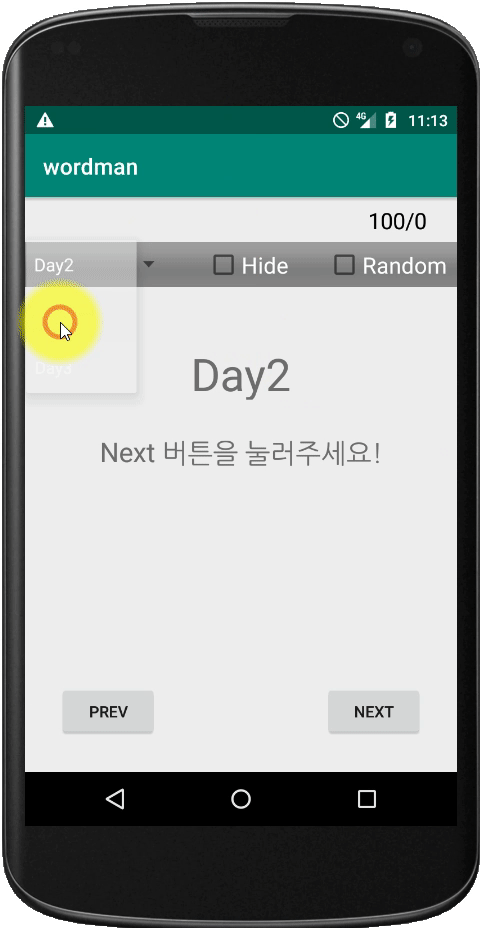

# Word Man App

안드로이드 단어 연습장

## Info

- 안드로이드에서 `단어 연습`을 할 수 있는 연습장입니다.
- 순서를 `랜덤`으로 표시하게 할 수 있습니다.
- 숨긴 상태로 다음에 보일 단어를 표시할 수 있습니다.
- 단어장 형태로 구분 가능합니다.
  
## Finally

- 안드로이드 공부를 하면서 구현한 앱입니다.

## Copyright

- 비상업적 용도로 사용 가능하며 링크를 반드시 포함해주세요.
- 문제가 되는 내용이 있다면 언제든지 [`issue`](https://github.com/Sotaneum/Word-Man-App/issues/new), [`Pull requests`](https://github.com/Sotaneum/Word-Man-App/compare) 부탁드립니다.
